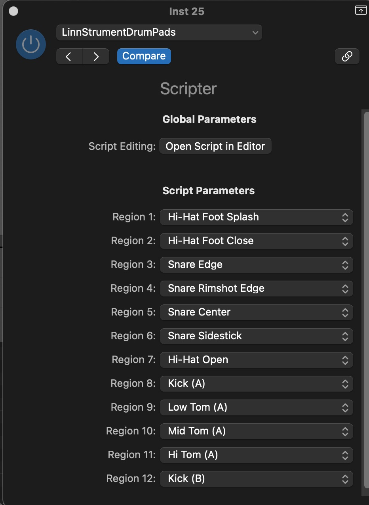
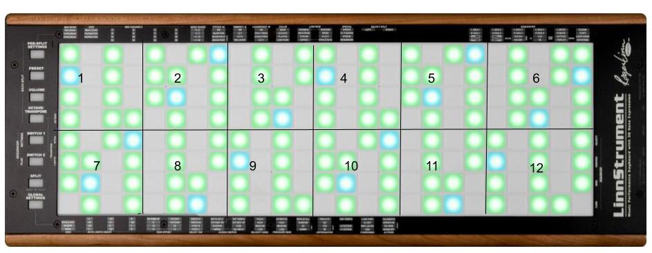

# LinnStrument Drum Pads

A Logic Pro [Scripter](https://support.apple.com/en-ca/guide/logicpro/lgcecc16550d/mac) script which divides LinnStrument
into 12 regions, each of which can be assigned to a different
drum kit piece. This allows you to play drums with a little less precision - as long as you hit a pad in the region, you'll hear the desired kit piece.

**NOTE**: Currently only the 200-pad LinnStrument is supported.
If you are the owner of a 128-pad LinnStrument and want to use this script, please contact me by filing an [issue](https://github.com/dtenenba/LinnStrumentDrumPads/issues/new) in this repository. Once I get a bit of information from you about your LinnStrument I will be able to add support for that model.

## How to use

### LinnStrument setup

1. Turn Split mode off if it is on. Press the `Split` button 
until you only see two LED colors - blue for C notes and green
for other notes in the C major scale. 
1. Change MIDI Mode to "Channel Per Row". Press "Per-Split Settings" and under MIDI Mode (first column, top left) press
the pad 3 rows down, labeled `ChPerRow`. Enable this setting for
both splits.

### Logic Pro setup

1. Create a new Software Instrument track with Drum Kit Designer as the instrument (other drum instruments, such as Drum Machine Designer, have not (yet) been tested with this script).
1. Under MIDI FX, choose Scripter. 
1. In the Editor window, type Command-A to select all text and press backspace/delete to delete it. 
1. Paste in the contents of the [script](https://raw.githubusercontent.com/dtenenba/LinnStrumentDrumPads/main/script.js).
1. In the Scripter window, click the drop-down where it says FactoryDefault. Choose `Save As...`. Give the script a name like `LinnStrumentDrumPads`. In future you can get directly to this script by clicking the dropdown and going to that name.
1. In the Editor window, click `Run Script`. 

You will see the adjustable parameters:

This lets you assign a different kit piece to each of 12 "regions" on the LinnStrument. This is the region layout:

Each region is 4 rows by 4 columns, except regions 6 and 12 which are 5 columns wide (since there are an odd number of columns on the 200-pad LinnStrument).

**NOTE**: the default parameter values (mapping of regions to kit pieces) was designed by me (not a drummer) to have the higher pitched kit pieces (cymbals, snare, etc). on the top row and the lower pitched pieces (tom, kick, etc.) on the bottom row. I am open to feedback from drummers or anyone else about what might be a more optimal arrangement. 

Now - play your LinnStrument and you should hear the desired kit piece when you play any pad in the corresponding region.

## Questions or comments?

I welcome [feedback](https://github.com/dtenenba/LinnStrumentDrumPads/issues/new).

